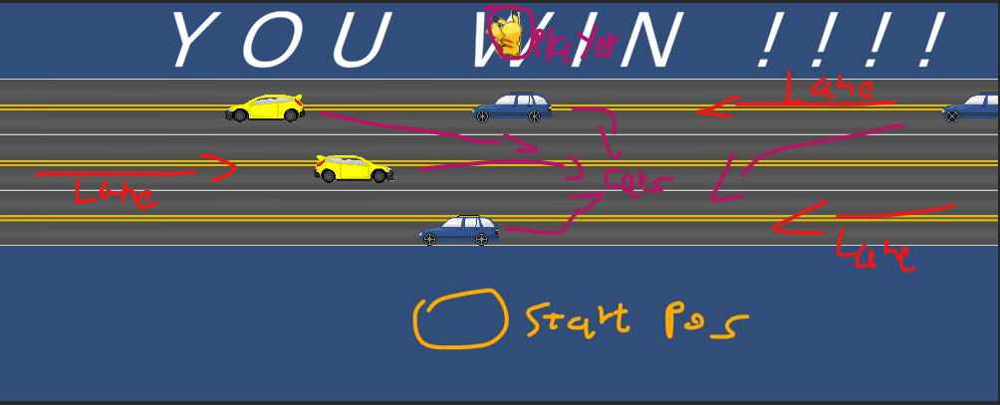

# Colliders
## Task 1
Scene: "5-task-1"

The changes that have been made to the spaceship game is as follows:
- Added an item spawn, spawns bonus items randomly from top of the screen (random on X-axis)
    - Each item spawns with random movement SPEED.
    - Each item spawns with random movement DIRECTION.
    - Each item spawns with random ROTATION & ROTATION SPEED.
- There are few bonus items to be spawned such as:
    - A shield that protects the player from colliding with enemeis for 4 seconds, animated.
    - A bomb that destroys all enemies in the game.
- Enemy spawns are now moving linearly across the X-axis to make the spawn position more random.

## Task 2
Note: Features are added to the scenes at each additional scene.
- Scene: "5-task-2" (part A + part B)
    - The scene has solid walls that the player can't move through in form of yellow stars (Player is now a physical object using Dynamic RigidBody2D instead of Triggerable Kinematic)
    - There are "DestroyerBorders" on top and bottom of the game that destory objects that gets out of the screen when it collides with them.
- Scene: "5-task-2c" (part C).
    - In additional to features that are in "5-task-2", the map/world is now circular using 4 "border" objects, 1 for each side that warps/teleports the player relativly (for reuse reasons) to a new position.

## Task 3
With respect to Jumper frog (Or Frogger) we've created Pikachu Crasher, where pikachu has to cross 3 lanes of blazing-fast moving cars and reach the other side of the map, when the player reaches the other side of the map he collides with a trigger that displays "Y O U  W I N ! ! !" on the screen, otherwise, if the player get smashed by a car, "YOU LOSE" is displayed instead.

